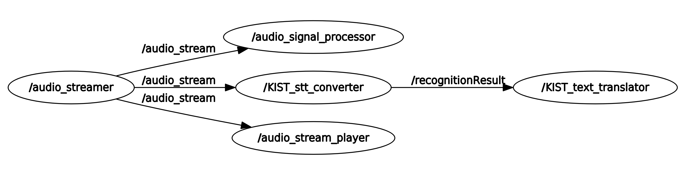

sHRI-Lab : Audio Interface
===========================================================

ROS 기반 Audio 입출력 Interface
- Signal Processing
- Speech to text Converter
- Text translator

## 1 Framework Structure



## 2 Requirements

-	Ubuntu 16.04 or later
-	[ROS](http://wiki.ros.org/) - Robot Operating System.
-	Many python package(requirements_py2.txt, requirements_py3.txt)
```bash
sudo apt-get install libasound-dev portaudio19-dev libportaudio2 libportaudiocpp0
sudo pip install -r requirements_py2.txt
sudo pip3 install -r requirements_py3.txt

sudo pip install --upgrade pip setuptools
sudo pip install --upgrade pip setuptools
sudo pip install --upgrade pyasn1
```
-   Mic Setup

Alsa 에서 마이크 장치로 인식되는 장치의 spec을 launch 파일에 기입.
아래 명령으로 확인 할 수 있음
```bash
rosrun audio_streamer check_input_device.py
```
-   google stt api service key 등록

본 패키지는 google STT 기능을 이용하기 때문에 Google Cloud Platform의 STT servicekey를 발급후 아래의 경로에 삽입

```bash
mv serivce_key.json speech_to_text_converter/service_key/
```


## 3. Usage
--------

Default
```bash
roslaunch bringup_audio_interface bringup_audio_interface.launch
```

MIC Stream Player

```bash
roslaunch bringup_audio_interface bringup_audio_stream_player.launch
```